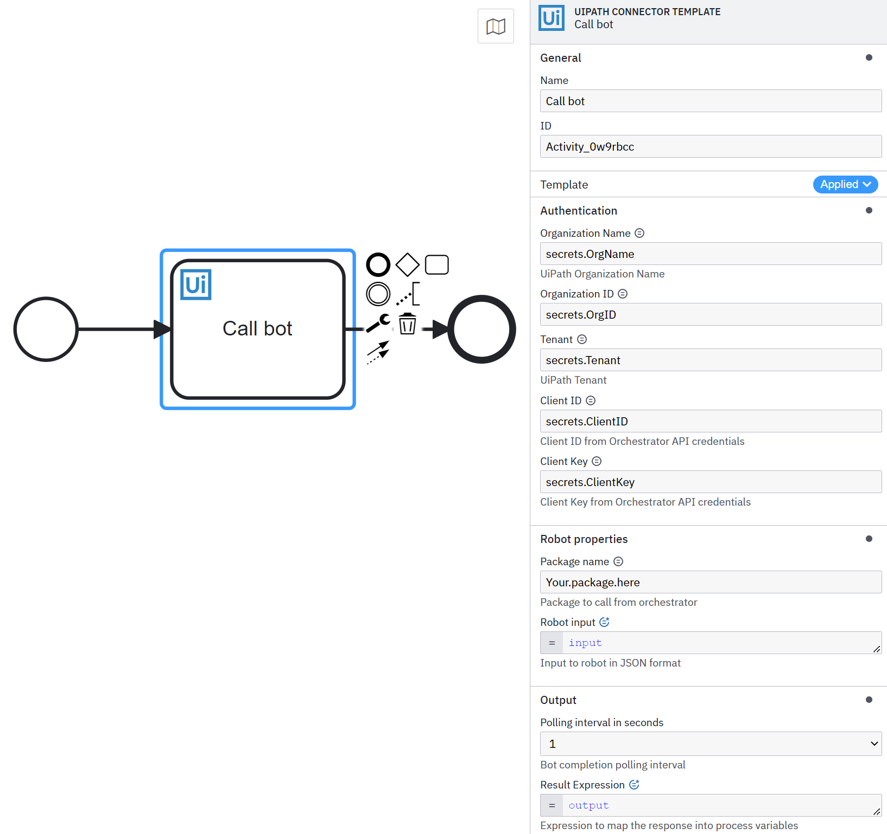

[](https://github.com/camunda-community-hub/community)
[](https://github.com/Camunda-Community-Hub/community/blob/main/extension-lifecycle.md#proof-of-concept-)


# UiPath Connector Template

!!! Work in progress !!!

A starting point to build a UiPath Connector to kick off bots and return results to Camunda Platform. Feedback and PRs are welcome! In the Connector you'll need to provide your UiPath Organization Name, ID, and Tenant.
You'll also need to provide a Client ID and Key. Ideally, these parameters are stored as secrets rather than exposing them as static values in the properties panel.

Provide the package name of the bot to be invoked followed by a well formed JSON of the bot inputs. Select a polling interval (1-4 seconds) to check on bot completion. Output is prefilled with an 'output' object. Should be left alone unless access to data within the object is needed. Use JSON dot notation to access information within the 'output' object



# TODO / Next steps

- See if long polling for bot completion is available
- Better error handling


## Build

You can package the Connector by running the following command:

```bash
mvn clean package
```

This will create the following artifacts:

- A thin JAR without dependencies.
- An uber JAR containing all dependencies, potentially shaded to avoid classpath conflicts. This will not include the SDK artifacts since those are in scope `provided` and will be brought along by the respective Connector Runtime executing the Connector.

### Shading dependencies

You can use the `maven-shade-plugin` defined in the [Maven configuration](./pom.xml) to relocate common dependencies
that are used in other Connectors and the [Connector Runtime](https://github.com/camunda-community-hub/spring-zeebe/tree/master/connector-runtime#building-connector-runtime-bundles).
This helps avoiding classpath conflicts when the Connector is executed.

Use the `relocations` configuration in the Maven Shade plugin to define the dependencies that should be shaded.
The [Maven Shade documentation](https://maven.apache.org/plugins/maven-shade-plugin/examples/class-relocation.html)
provides more details on relocations.


### Test with local runtime

Use the [Camunda Connector Runtime](https://github.com/camunda-community-hub/spring-zeebe/tree/master/connector-runtime#building-connector-runtime-bundles) to run your function as a local Java application.

In your IDE you can also simply navigate to the `LocalContainerRuntime` class in test scope and run it via your IDE.
If necessary, you can adjust `application.properties` in test scope.

## Element Template

The element templates can be found in the [element-templates/template-connector.json](element-templates/jdbc-connector.json) file.